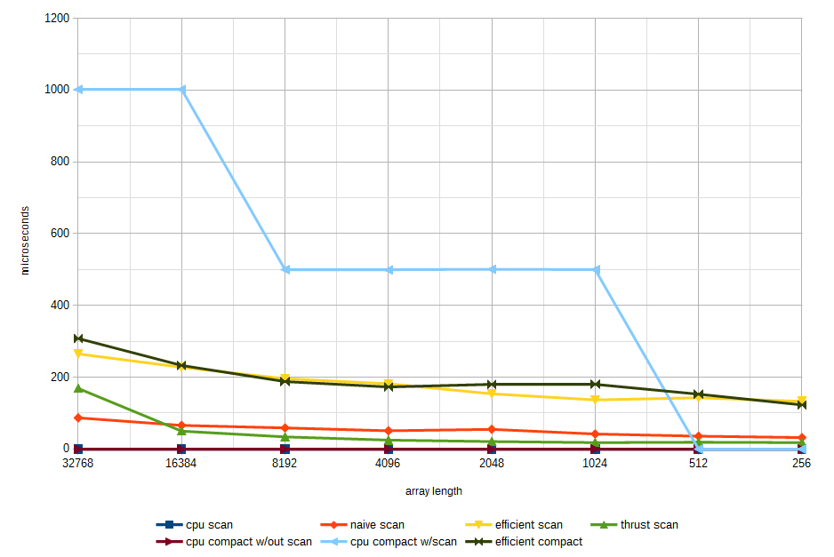

CUDA Stream Compaction
======================

**University of Pennsylvania, CIS 565: GPU Programming and Architecture, Project 2**

* Kangning Li
* Tested on: Windows 10, i7-4790 @ 3.6GHz 16GB, GTX 970 4096MB (Personal)

This repository contains HW2 for CIS 565 2015, GPU implementations of scan and compact.

## Analysis



|array size | cpu scan | naive scan | efficient scan | thrust scan| cpu compact w/out scan| cpu compact w/scan | efficient compact
|-----------|----------|------------|----------------|------------|-----------------------|--------------------|-------------------
|32768      | 0        | 87         | 265            |   169      |   0                   | 1002               | 308
|16384      | 0        | 66         | 228            |   50       |   0                   | 1002               | 233
|8192       | 0        | 59         | 196            |   34       |   0                   | 500                | 188
|4096       | 0        | 51         | 182            |   25       |   0                   | 499                | 173
|2048       | 0        | 55         | 154            |   21       |   0                   | 501                | 180
|1024       | 0        | 42         | 137            |   18       |   0                   | 500                | 181
|512        | 0        | 36         | 143            |   19       |   0                   | 0                  | 153
|256        | 0        | 32         | 133            |   18       |   0                   | 0                  | 123

The data tells us some obvious things, such as the fact that generally computation is faster when there is less data. However, the speed difference between teh CPU and GPU implementations indicate something suboptimal in the GPU code. The GPU code was timed without taking into account memory operations, so the difficulty may be in a lack of optimized register use or excess memory access besides explicit operations like copies, allocations, and frees. What is also interesting is that thrust scan, though faster than my implementation, is still slower than the CPU implementation.
Further analysis is required. It is also possible that the CPU implementation has not been timed correctly, or that the more expected benefits of GPU parallelization only become apparent with larger amounts of data than were measured.

Another note is that this project implements efficient scan by modifying an array on the device in-place in both the upsweep and downsweep stages.
There were some concerns over race conditions when multiple blocks are needed, however, these did not arise. The project's commit history includes a version of efficient scan that uses an input and output array for the kernel but requires a memcpy to synchronize data in the two from the host in between passes.

## Notes
I added an additional "small" case test for debugging use.
Efficient Scan also has disabled desting code for "peeking" at the results of up-sweep before down-sweep.

## Example Output

```
****************
** SCAN TESTS **
****************
    [  38  19  38  37   5  47  15  35   0  12   3   0  42 ...   7   0 ]
==== cpu scan, power-of-two ====
    [   0  38  57  95 132 137 184 199 234 234 246 249 249 ... 803684 803691 ]
==== cpu scan, non-power-of-two ====
    [   0  38  57  95 132 137 184 199 234 234 246 249 249 ... 803630 803660 ]
    passed
==== small cpu scan test. ====
    passed
==== naive scan, power-of-two ====
    passed
==== naive scan, non-power-of-two ====
    passed
==== small naive scan test. ====
    passed
==== small naive scan test, non-power-of-two. ====
    passed
==== small work efficient scan test. ====
    passed
==== small work efficient scan test, non-power-of-two. ====
    passed
==== work-efficient scan, power-of-two ====
    passed
==== work-efficient scan, non-power-of-two ====
    passed
==== small thrust scan. ====
    passed
==== thrust scan, power-of-two ====
    passed
==== thrust scan, non-power-of-two ====
    passed

*****************************
** STREAM COMPACTION TESTS **
*****************************
    [   2   3   2   1   3   1   1   1   2   0   1   0   2 ...   3   0 ]
==== small cpu compact without scan, power-of-two ====
    passed
==== small cpu compact without scan, non-power-of-two ====
    passed
==== cpu compact without scan, power-of-two ====
    [   2   3   2   1   3   1   1   1   2   1   2   1   1 ...   2   3 ]
    passed
==== cpu compact without scan, non-power-of-two ====
    [   2   3   2   1   3   1   1   1   2   1   2   1   1 ...   2   2 ]
    passed
==== small cpu compact with scan, power-of-two ====
    passed
==== small cpu compact with scan, non-power-of-two ====
    passed
==== cpu compact with scan ====
    [   2   3   2   1   3   1   1   1   2   1   2   1   1 ...   2   3 ]
    passed
==== small work-efficient compact with scan, power-of-two ====
    passed
==== small work-efficient compact with scan, non-power-of-two ====
    passed
==== work-efficient compact, power-of-two ====
    [   2   3   2   1   3   1   1   1   2   1   2   1   1 ...   2   3 ]
    passed
==== work-efficient compact, non-power-of-two ====
    [   2   3   2   1   3   1   1   1   2   1   2   1   1 ...   2   2 ]
    passed

```